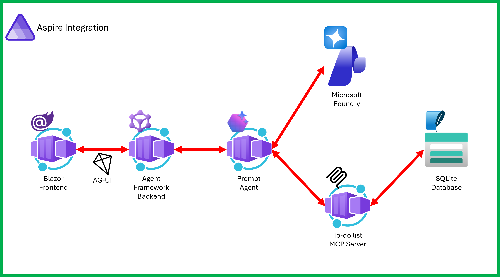

# Microsoft Agent Framework and Foundry Starter Pack in .NET

This is a starter template to build a .NET-based agentic AI app using [Microsoft Agent Framework](https://aka.ms/agent-framework) and [Microsoft Foundry](https://aka.ms/microsoft-foundry) with [Aspire](https://aspire.dev).

## Features



This stater template provides the following features:

- [Blazor](https://blazor.net) frontend for chat UI
- [ASP.NET](https://asp.net) backend with Microsoft Agent Framework
- [Microsoft Foundry Hosted Agents](https://aka.ms/microsoft-foundry/hosted-agents) service for agent hosting
- [To-do list management MCP server](https://aka.ms/mcp/dotnet/samples/todolist) for tooling support to agent
- Aspire for cloud-native app orchestration

## Prerequisites

- [Azure subscription (free)](http://azure.microsoft.com/free)
- [.NET 10 SDK](https://dotnet.microsoft.com/download/dotnet/10.0) or higher
- [Visual Studio 2026](https://visualstudio.microsoft.com/downloads/) or [VS Code](https://code.visualstudio.com/download) + [C# Dev Kit](https://marketplace.visualstudio.com/items?itemName=ms-dotnettools.csdevkit)
- [Docker Desktop](https://docs.docker.com/desktop/) or equivalent
- [Azure Developer CLI](https://learn.microsoft.com/azure/developer/azure-developer-cli/install-azd)
- [Azure CLI](https://learn.microsoft.com/cli/azure/install-azure-cli)
- [Aspire CLI](https://aspire.dev/get-started/install-cli/)

## Quickstart

This starter pack has a two-step deployment process.

1. Deploy agent to Microsoft Foundry.
1. Deploy apps via Aspire.

### Get repository root

1. Get the repository root.

    ```bash
    # bash/zsh
    REPOSITORY_ROOT=$(git rev-parse --show-toplevel)
    ```

    ```powershell
    # PowerShell
    $REPOSITORY_ROOT = git rev-parse --show-toplevel
    ```

### Login to Azure

1. Login to Azure using `azd`.

    ```bash
    azd auth login
    ```

1. Login to Azure using `az`.

    ```bash
    az login
    ```

### Deploy Microsoft Foundry Prompt Agent

1. Navigate to the `resources-foundry` directory.

    ```bash
    cd $REPOSITORY_ROOT/resources-foundry
    ```

1. Deploy a prompt agent to Microsoft Foundry.

    ```bash
    azd up
    ```

   While provisioning, you might be asked to enter environment name, Azure subscription and location.

   > [!NOTE]
   > You may have to set the environment variable, `AZURE_TENANT_ID`.
   >
   > ```bash
   > # bash/zsh
   > AZURE_TENANT_ID=$(az account show --query "tenantId" -o tsv)
   > ```
   >
   > ```bash
   > # PowerShell
   > $env:AZURE_TENANT_ID = az account show --query "tenantId" -o tsv
   > ```

### Deploy apps to Azure

1. Make sure you're at the repository root.

    ```bash
    cd $REPOSITORY_ROOT
    ```

1. Deploy the app.

    ```bash
    azd up
    ```

   While provisioning, you might be asked to enter environment name, Azure subscription and location.

### Run apps locally

1. Make sure you're at the repository root.

    ```bash
    cd $REPOSITORY_ROOT
    ```

1. Run Aspire.

    ```bash
    aspire run --project ./src/MafStarterPack.AppHost
    ```

## Resources

- [Microsoft Agent Framework](https://aka.ms/agent-framework)
- [Microsoft Foundry](https://aka.ms/microsoft-foundry)
- [Microsoft Foundry Agent Service](https://aka.ms/microsoft-foundry/agent-service)
- [Model Context Protocol (MCP)](https://modelcontextprotocol.io)
- [Aspire](https://aspire.dev)
